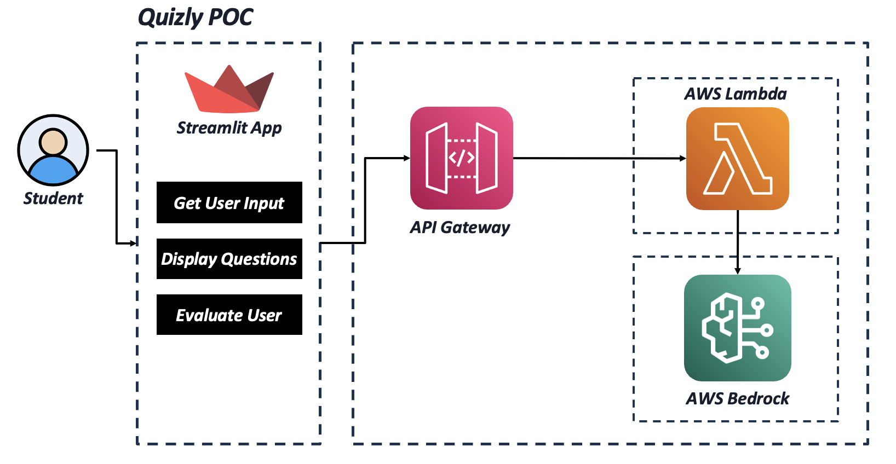

# AI Quiz Generator

An intelligent quiz generation system that creates context-based multiple-choice questions with dynamic difficulty levels.

## Project Overview

AI Quiz Generator is a web application that leverages AI to generate customized quizzes based on user-provided contexts. The system creates multiple-choice questions of varying difficulty levels, from "Very Easy" to "Legendary", making it suitable for learning and assessment across different knowledge domains.

## Architecture

The project follows a client-server architecture:

1. **Frontend**: Streamlit web application that provides the user interface
2. **API Layer**: FastAPI service that handles quiz generation requests
3. **Backend Logic**: Core quiz generation functionality powered by AWS Bedrock and Claude AI
4. **Vector Database**: Pinecone for context storage and retrieval

### Architecture Diagram



## Features

- **Context-Based Quiz Generation**: Create questions based on any topic or subject area
- **Adjustable Difficulty Levels**: Choose from 5 difficulty levels (Very Easy to Legendary)
- **Customizable Number of Questions**: Generate between 1-20 questions per quiz
- **Multiple-Choice Format**: All questions come with 4 options and one correct answer
- **Instant Scoring**: Get immediate feedback on quiz performance
- **Detailed Explanations**: View explanations for all answers after submission

## Technical Components

- **Streamlit**: Web interface for quiz interaction
- **FastAPI**: RESTful API service for quiz generation
- **AWS Bedrock**: AI service for generating quiz content
- **Claude 3.5 Sonnet**: Large language model used for question generation
- **Pinecone**: Vector database for context storage
- **Boto3**: AWS SDK for Python

## Setup and Installation

### Prerequisites

- Python 3.8+
- AWS account with Bedrock access
- Pinecone account

### Environment Setup

1. Clone the repository
```bash
git clone https://github.com/yourusername/ai-quiz-generator.git
cd ai-quiz-generator
```

2. Install dependencies
```bash
pip install -r requirements.txt
```

3. Configure AWS credentials
```bash
aws configure
```

### Running the Application

1. Start the FastAPI server:
```bash
python controller.py
```

2. In a separate terminal, start the Streamlit app:
```bash
streamlit run app.py
```

3. Open your browser and navigate to the provided URL (typically http://localhost:8501)

## API Endpoints

- **POST /generate-quiz**: Generate quiz questions based on context
  - Request body:
    ```json
    {
      "context": "AWS Services",
      "difficulty": 3,
      "num_questions": 5
    }
    ```

- **GET /health**: Health check endpoint

## Usage Guide

1. Enter a topic or subject in the "Quiz Context" field
2. Select the desired number of questions (1-20)
3. Choose a difficulty level
4. Click "Generate Questions"
5. Answer the questions and submit
6. View your score and optionally see explanations

## Project Structure

```
ai-quiz-generator/
├── app.py              # Streamlit frontend application
├── controller.py       # FastAPI endpoints
├── main.py             # Core quiz generation logic
├── docs/               # Documentation assets
│   └── architecture_diagram.png  # System architecture diagram
├── requirements.txt    # Project dependencies
└── README.md           # Project documentation
```

## Future Enhancements

- User authentication and quiz history
- Export quiz results as PDF
- Additional question formats (true/false, fill-in-the-blank)
- Customizable topics and subtopics
- Time-limited quiz sessions

## License

[MIT License](LICENSE)

## Acknowledgments

- AWS Bedrock for providing the AI infrastructure
- Anthropic for Claude 3.5 Sonnet model
- Pinecone for vector database capabilities
